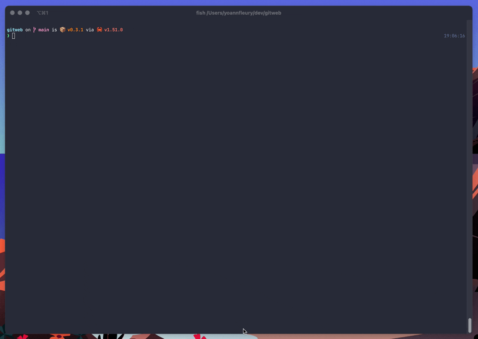

# gitweb


> Some of the flags and options are subject to change in the future.
> Ideas are welcome. Ideas are bulletproof (V).

`gitweb` is a command line interface I created mainly to learn Rust.



## Intallation

### The Cargo way

```
cargo install gitweb
```

### The binary way

Download the binary from the [latest release](https://github.com/yoannfleurydev/gitweb/releases/latest) and put it in your PATH.

## Usage

`gitweb` will by default open the remote in the browser of the current
repository.

```
gitweb 0.3.0

USAGE:
    gitweb [FLAGS] [OPTIONS]

FLAGS:
    -h, --help             Prints help information
    -M, --merge-request    Set the merge request flag
    -V, --version          Prints version information
    -v, --verbose          Set the verbosity of the command

OPTIONS:
    -b, --branch <branch>      Set the branch (alias for --tag)
    -B, --browser <browser>    Set the browser [env: BROWSER=]
    -c, --commit <commit>      Set a commit
    -r, --remote <remote>      Set the remote
    -t, --tag <tag>            Set the tag (alias for --branch)
```

## --branch, --tag

`gitweb` will open the current branch or tag on the remote repository. You can
override the behavior by giving either `--branch` or `--tag` flag with the
custom branch or tag you want to open in the browser.

## --browser

`gitweb` tries to start one of the following browser (in that order of priority):

- `--browser` option given in the command line
- `$BROWSER` on Linux 🐧 or `%BROWSER%` on Windows 🏁 (this is a non standard variable)
- the default web browser on the system

## --commit

`gitweb` will open the commit given as a parameter on the remote repository.

## --remote

`gitweb` will open the origin remote if it exists. You can override the behavior
by giving the `--remote` flag with the custom remote you want to open.
